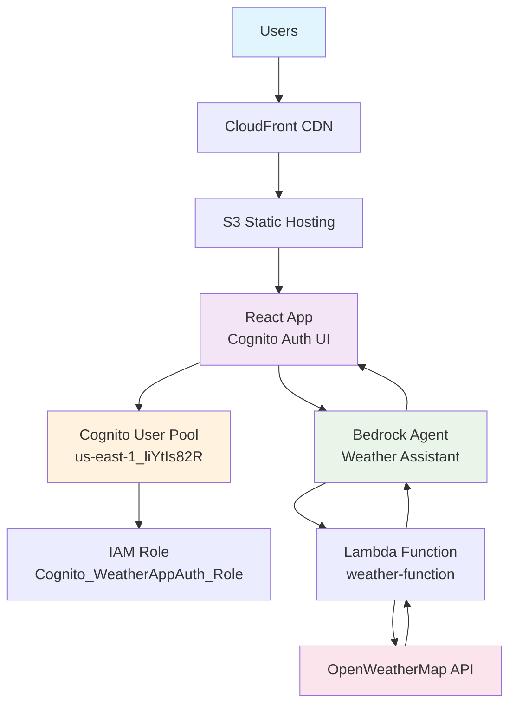

# AWS Architecture Diagram - Generated by MCP Server

## Mermaid Diagram

## How to View the Diagram

1. **Copy the Mermaid code above**
2. **Go to https://mermaid.live/**
3. **Paste the code** in the editor
4. **View the rendered diagram**

## Architecture Components

### Frontend Layer (Blue)
- **Users**: End users accessing the application
- **React App**: Frontend with Cognito authentication UI

### Infrastructure Layer
- **CloudFront CDN**: Content delivery network
- **S3 Static Hosting**: Hosts the React application

### Authentication Layer (Orange)
- **Cognito User Pool**: `us-east-1_liYtIs82R`
- **IAM Role**: `Cognito_WeatherAppAuth_Role`

### AI Services Layer (Green)
- **Bedrock Agent**: Weather Assistant with natural language processing
- **Lambda Function**: `weather-function` for API integration

### External Services Layer (Pink)
- **OpenWeatherMap API**: Provides real-time weather data

## Data Flow

1. Users access the React app through CloudFront CDN
2. App is served from S3 static hosting
3. Users authenticate via Cognito User Pool
4. Cognito assumes IAM role with Bedrock permissions
5. Users ask weather questions in natural language
6. Bedrock agent processes the query
7. Agent invokes Lambda function
8. Lambda calls OpenWeatherMap API
9. Weather data flows back to the user