# Product Opportunity Recommendation System Architecture

```mermaid
graph TB
    User[👤 User] --> React[📱 React App<br/>Amplify Hosting]
    React --> Cognito[🔐 Amazon Cognito<br/>Authentication]
    React --> ProductAgent[🤖 Product Opportunity Agent<br/>Bedrock]
    React --> WeatherAgent[🌤️ Weather Agent<br/>Bedrock]
    
    ProductAgent --> Lambda1[⚡ Lambda Functions<br/>DCC Analysis]
    WeatherAgent --> Lambda2[⚡ Lambda Functions<br/>Weather Data]
    
    Lambda1 --> Bedrock[🧠 Amazon Bedrock<br/>Claude 3 Haiku]
    Lambda2 --> Bedrock
    
    style User fill:#e1f5fe
    style React fill:#f3e5f5
    style Cognito fill:#fff3e0
    style ProductAgent fill:#e8f5e8
    style WeatherAgent fill:#e8f5e8
    style Lambda1 fill:#fff8e1
    style Lambda2 fill:#fff8e1
    style Bedrock fill:#fce4ec
```

## Components
- **React Frontend**: Tabbed UI with authentication
- **Amazon Cognito**: User authentication & management
- **Bedrock Agents**: AI-powered chat interfaces
- **Lambda Functions**: Serverless business logic
- **Claude 3 Haiku**: LLM for analysis & responses